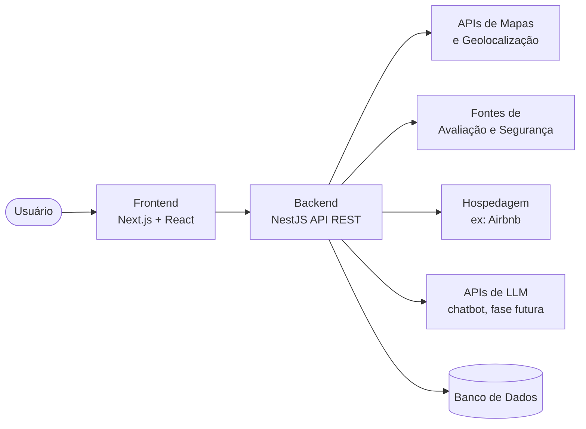

# Visão Arquitetural

O Triplaner adota uma arquitetura web com separação clara entre cliente, servidor e serviços externos. O objetivo é favorecer o desenvolvimento full-stack ágil, mantendo o projeto sustentável para uma dupla.

## Panorama

## Camadas

### Frontend

Aplicação em Next.js com React e TypeScript, responsável pela interface de montagem de roteiros. Concentra a experiência do usuário: seleção de preferências, visualização do roteiro, gestão de pausas e, em fase futura, a interface do assistente conversacional.

### Backend

API REST em NestJS, responsável por orquestrar as chamadas externas de forma assíncrona e eficiente. É a camada que cruza dados de mapas, segurança e hospedagem, aplica as regras de geração de roteiro e expõe os resultados para o frontend.

### Serviços externos

O produto depende da integração com serviços de terceiros:

- **Mapas e geolocalização**: cálculo de distâncias e rotas.
- **Avaliações e segurança**: dados de experiência de outras pessoas sobre a segurança dos locais.
- **Hospedagem**: recomendações de moradias próximas ao roteiro.
- **Modelos de linguagem (LLM)**: processamento de linguagem natural do chatbot, previsto para uma fase posterior.

## Princípios

- **Separação de responsabilidades**: frontend, backend e documentação vivem em repositórios próprios, cada um com seu ciclo de evolução.
- **Integração assíncrona**: a orquestração de múltiplas APIs externas é feita de forma assíncrona para não bloquear a experiência do usuário.
- **Custo sob controle**: as integrações mais caras (geolocalização e LLM) são adotadas de forma incremental, acompanhando as fases do produto.

O detalhamento das tecnologias está em [Stack Tecnológico](./stack-tecnologico.md), e a organização dos repositórios em [Estrutura do Repositório](./estrutura-do-repositorio.md).
