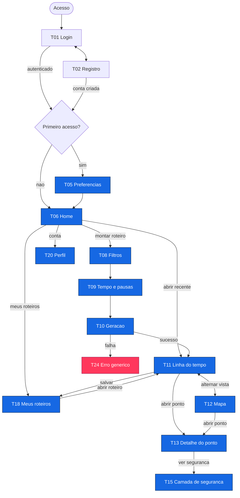
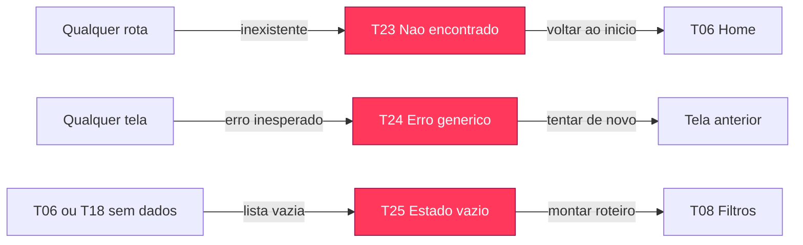

# Fluxo de Telas do MVP

Este documento conecta as 16 telas do MVP em uma jornada, o que a lista do Mapa de Telas não mostra. Ele existe por dois motivos: fechar quais telas e estados precisam ser desenhados antes de qualquer pixel, e servir de briefing para gerar o design system e as telas no Figma.

As telas seguem a numeração do [Mapa de Telas](./mapa-de-telas.md). O escopo aqui é apenas o MVP: T01, T02, T05, T06, T08 a T13, T15, T18, T20 e as telas de sistema T23, T24 e T25.

## Portas de entrada

Antes da jornada principal, dois desvios controlam o acesso:

- **Autenticação.** Toda rota protegida exige sessão. Sem sessão, o usuário cai em T01. O backend de login e registro já existe.
- **Primeiro acesso.** Logo após criar a conta ou no primeiro login, o usuário passa por T05 para coletar preferências. Nos acessos seguintes vai direto para a Home.

## Jornada principal

O eixo central é `T08 → T09 → T10 → T11`, a criação do roteiro. A partir do roteiro pronto, o usuário circula entre linha do tempo, mapa, detalhe do ponto e segurança sem sair do contexto, e salva o resultado em Meus Roteiros.

## Telas de sistema

Estados globais que qualquer tela pode acionar. São desenhados uma vez e reaproveitados.

## Detalhamento por tela

Cada linha é o briefing de uma tela: o objetivo, os estados a desenhar e para onde ela leva. Os estados seguem o lembrete do Mapa de Telas: nem toda tela é um só desenho.

| Tela | Objetivo | Estados a desenhar | Saídas |
| --- | --- | --- | --- |
| T01 Login | Autenticar com email e senha | Padrão, enviando, erro de credencial | T02, T06, recuperar senha |
| T02 Registro | Criar conta com senha forte | Padrão, validando, enviando, erro | T01, T05 |
| T05 Preferências | Coletar gostos para alimentar filtros | Padrão, salvando | T06 |
| T06 Home | Busca dominante, atalhos e recentes | Com recentes, vazio, carregando | T08, T18, T20, T11 |
| T08 Filtros | Locomoção, atividade, datas e destino | Padrão, validação de campos | T09 |
| T09 Tempo e pausas | Janelas, pausas, retorno e margem | Padrão, validação | T10 |
| T10 Geração | Progresso enquanto monta o roteiro | Carregando, sucesso, falha | T11, T24 |
| T11 Linha do tempo | O dia em blocos, com anotações | Conteúdo, carregando, vazio | T12, T13, T18 |
| T12 Mapa | Explorar pontos e rota do dia | Conteúdo, carregando mapa, erro de tile | T11, T13 |
| T13 Detalhe do ponto | Dados do local e ação | Conteúdo, carregando | T15, volta ao roteiro |
| T15 Camada de segurança | Classificação, áreas e rotas | Conteúdo, sem dados de segurança | Volta ao detalhe |
| T18 Meus roteiros | Listar roteiros salvos | Com itens, vazio, carregando | T11 |
| T20 Perfil | Dados da conta | Conteúdo, salvando | Home |
| T23 Não encontrado | Rota inexistente | Único | T06 |
| T24 Erro genérico | Fronteira de erro com recuperação | Único | Tela anterior |
| T25 Estado vazio | Sem roteiros ou resultados | Único | T08 |

## Legenda

- **Azul**: telas do fluxo principal, na cor `primary`.
- **Vermelho**: telas de sistema e falha, na cor de marca `cta`, com traço em `wine`.
- Setas de mão dupla indicam alternância sem perda de contexto, como linha do tempo e mapa.

Este fluxo é a base do próximo passo: gerar no Figma o design system a partir dos tokens do frontend e, sobre ele, cada uma destas telas com seus estados.
