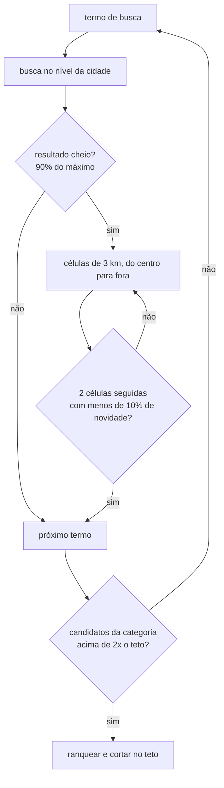

# Varredura de Cidade

A varredura de cidade (city scan) é o modo principal de uso do serviço: o viajante escolhe o destino, e o serviço descobre e pontua tudo que dá para visitar. Esta página descreve como a descoberta funciona, quantas requisições uma cidade custa e como o volume é controlado.

## Como a cidade é delimitada

1. O nome (e opcionalmente o país) é geocodificado no Nominatim, o geocodificador público do OpenStreetMap. Não exige chave; exige um `User-Agent` identificando o serviço e no máximo uma requisição por segundo.
2. O raio de busca é derivado do bounding box da cidade: metade da diagonal, limitado entre 3 e 25 km. Recife fica em torno de 10 km. O backend pode passar `lat`, `lng` e `radiusKm` para pular a geocodificação, por exemplo para varrer só um bairro.
3. Sobre o círculo da cidade é traçada uma malha quadrada de células de 3 km, ordenada do centro para fora. Uma cidade de 10 km de raio tem cerca de 37 células.

## Taxonomia de categorias

As categorias, os termos de busca e os limites ficam em `config/categories.yaml`, para serem ajustados sem mudar código.

| Categoria | Termos de busca | Teto de lugares | Piso de reviews | Perfil de critérios |
| --- | --- | --- | --- | --- |
| turismo | pontos turísticos, museus, igrejas históricas, monumentos, centro histórico, teatros, mirantes | 250 | 30 | default |
| natureza | praias, parques, trilhas, cachoeiras, jardim botânico, zoológico, aquário | 120 | 30 | default |
| passeios | passeio de barco, passeio de catamarã, tour guiado, agência de turismo, city tour, passeio de buggy, mergulho | 80 | 20 | default |
| gastronomia | restaurantes, restaurante regional, frutos do mar, churrascaria, pizzaria, cafeteria, padaria, comida de rua, vegetariano | 400 | 50 | gastronomia |
| vida noturna | bares, boteco, pub, casa de shows, balada, música ao vivo | 100 | 50 | vida_noturna |
| compras | shopping center, mercado público, feira de artesanato, loja de souvenirs | 50 | 50 | default |

A soma dos tetos é 1000 lugares. O parâmetro `maxPlaces` do request reescala os tetos mantendo a proporção entre categorias, e `categories` restringe a varredura a um subconjunto.

Por que esses números: gastronomia recebe o maior teto porque é a categoria com mais lugares em qualquer cidade e a que o viajante consulta mais vezes por dia de viagem. Turismo vem em seguida por ser o motivo da viagem. Compras é pequena porque poucos lugares da categoria têm reviews úteis para os critérios. O piso de reviews evita analisar lugares com amostra insuficiente para produzir um score confiável (a banda de confiança alta começa em 8 menções por critério).

## Estratégia de busca e requisições por cidade

Este é o ponto central do dimensionamento. Cada busca no Google Maps devolve no máximo cerca de 120 resultados por consulta e viewport, então a cobertura completa depende de combinar consultas por termo com consultas por célula geográfica. Uma abordagem ingênua (todos os termos em todas as células) faria 40 termos x 37 células = 1480 buscas por cidade, a maioria devolvendo os mesmos lugares. O serviço usa uma descida adaptativa:



A descoberta roda em dois passos sobre o mesmo browser, com três abas em paralelo (`DISCOVERY_PARALLEL_TABS`):

- **Passo rápido.** Uma busca curta por categoria (primeiro termo, 40 resultados), todas ao mesmo tempo. O resultado é gravado e enfileirado na hora e o job pai recebe `firstResultsAt`. Em 30 a 60 segundos a cidade já tem de 150 a 240 lugares consultáveis; o backend pode montar o primeiro roteiro a partir daí.
- **Passo profundo.** Categoria a categoria, as regras abaixo; ao fechar cada categoria os lugares novos são gravados e enfileirados, então a lista cresce enquanto a descoberta continua. Um lugar nunca entra duas vezes na fila do mesmo scan.

Regras do passo profundo, na ordem em que são aplicadas:

1. **Uma busca por termo no nível da cidade**, todos os termos da categoria em paralelo. Termos raros (mirantes, aquário, loja de souvenirs) esgotam aqui, com uma única requisição.
2. **Descida para células só quando o resultado veio cheio.** Se a busca da cidade devolveu 90% ou mais do máximo por consulta, há mais lugares do que a busca mostra, e o termo é repetido célula a célula.
3. **Parada por saturação.** Cada célula é comparada com o que já foi encontrado. Depois de duas células seguidas trazendo menos de 10% de lugares novos, o termo é encerrado: as células restantes são periferia.
4. **Parada por candidatos suficientes.** Quando uma categoria acumula mais de duas vezes o seu teto, os termos restantes da categoria são pulados.
5. **Teto absoluto de consultas por cidade** (250), como proteção contra cidades muito grandes ou termos que nunca saturam.
6. **Dedupe entre categorias.** Um restaurante que aparece na busca de "bares" não entra duas vezes; a primeira categoria a encontrá-lo fica com ele.
7. **Ranking por volume de reviews**, respeitando o piso da categoria. Lugares sem contagem conhecida passam pelo piso e vão para o fim da fila.

Projeção para uma capital média como Recife (raio 10 km, 37 células, 40 termos):

| Fase | Requisições | Tempo estimado (3 abas) |
| --- | --- | --- |
| Geocodificação | 1 | 1 s |
| Passo rápido (primeira lista) | 6 | 30 a 60 s |
| Buscas no nível da cidade | 40 | 4 a 5 min |
| Buscas em células (termos cheios, cerca de 10) | 50 a 80 | 4 a 7 min |
| Total de descoberta | 100 a 130 | 8 a 12 min |

Cada busca leva de 15 a 20 segundos porque o Chromium precisa rolar o feed de resultados até o fim, mais um intervalo de 2 segundos entre buscas para não pressionar o Google. Cidades pequenas param na regra 1 ou 2 e terminam em poucos minutos; megacidades batem no teto de 250 consultas.

Uma cidade nunca visitada, portanto, mostra a primeira lista em menos de um minuto e a lista completa em cerca de dez; os scores chegam depois, em horas com billing do Gemini ou em dias no free tier. Para os destinos mais procurados nem essa espera existe: `scripts/warm_cities.py` varre a lista de `config/warm_cities.yaml` antes do lançamento e o cache de 180 dias segura o resultado.

Depois da descoberta, a coleta de reviews (200 por lugar) e a classificação seguem por lugar, em 2 ou 3 workers paralelos. Para mil lugares:

| Recurso | Volume por cidade de mil lugares |
| --- | --- |
| Reviews baixadas | cerca de 200 mil, em 5 páginas de 44 reviews por lugar |
| Reviews relevantes após o pré-filtro | cerca de 95 mil (15% em atrações, 80% em gastronomia e bares) |
| Requisições de classificação (lotes de 20) | cerca de 4800 |
| Tempo de coleta | 2 a 3 horas com 3 workers |
| Custo de classificação com billing (Gemini Flash Lite) | em torno de US$ 4 |
| Tempo no free tier do Gemini (limite diário de requisições) | vários dias; o scan retoma automaticamente |

Esses valores são projeções por parâmetro; a validação em campo com Recife está pendente e ajustará os tetos.

## Cache e revalidação

- Uma cidade varrida dentro dos últimos 180 dias responde 200 imediatamente, sem novo job.
- `forceRefresh` refaz a descoberta, mas os lugares que ainda têm scores dentro da validade da sua categoria não são reanalisados. Só entram na fila os lugares novos, os vencidos e os que ficaram com reviews pendentes de um dia em que a cota acabou.
- Cada lugar guarda o `ftid` do Google Maps, o que permite reencontrá-lo em varreduras futuras e associá-lo ao Place ID quando o backend o tiver.

## Controle de custo

Antes de enfileirar os filhos, o job pai projeta o custo de classificação (lugares x reviews x taxa de relevância do perfil x tokens) e compara com o que resta do cap diário. Se não cabe, a fila é cortada proporcionalmente e a nota fica registrada no job; os lugares cortados entram no próximo scan. O limite diário de requisições do free tier funciona da mesma forma: o excedente permanece pendente em vez de falhar.

## Acompanhamento

O job pai passa pelos estágios `discover:quick`, `discover:deep`, `discover:{categoria}:{consultas}q:{lugares}p` e `analyzing`. `GET /jobs/{id}` devolve `firstResultsAt` assim que a primeira lista está gravada, mostra os contadores dos filhos e o pai fecha quando o último filho termina. Para testar localmente:

```bash
uv run python scripts/scan_city.py Recife --country Brasil --categories turismo --max-places 20 --reviews 60
```
