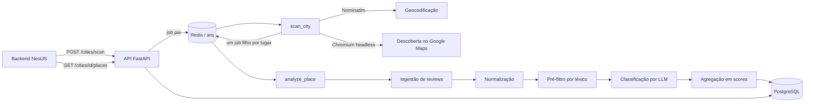

# Review Intelligence Service

O Review Intelligence Service é o serviço do Triplaner que responde a duas perguntas para cada destino de viagem: **o que dá para visitar nesta cidade** e **como cada lugar se comporta em critérios que importam para o viajante** (segurança, iluminação, caminhabilidade e, para restaurantes e bares, comida, atendimento, custo-benefício, ambiente, higiene e espera).

Ele vive no diretório `webscraper/` do projeto, é escrito em Python (FastAPI, arq, SQLAlchemy, Playwright) e expõe uma API REST consumida pelo backend NestJS. O backend não mantém lista própria de pontos de interesse: o serviço descobre, ranqueia e pontua tudo, e o backend consulta o resultado ao montar o roteiro.

## O que o serviço entrega

- Para uma cidade: uma lista de até mil lugares agrupados em seis categorias (turismo, natureza, passeios, gastronomia, vida noturna, compras), com nota do Google, volume de reviews e scores por critério.
- Para um lugar: scores de 0 a 100 por critério, nível de confiança (alta, média, baixa, insuficiente), tamanho da amostra e até três trechos de reviews como evidência.
- Frescor explícito: toda resposta informa quando os scores foram calculados e se já passaram do prazo de validade da categoria.

## Fluxo de ponta a ponta

O pipeline por lugar tem cinco etapas:

| Etapa | O que faz |
| --- | --- |
| Ingestão | Baixa as reviews públicas do Google Maps (200 mais recentes na varredura de cidade, até 1500 na análise avulsa) com dedupe por review. |
| Normalização | Limpa o texto, detecta o idioma e descarta reviews vazias. |
| Pré-filtro | Marca como relevantes apenas as reviews que citam termos do léxico dos critérios do perfil do lugar. Para pontos turísticos isso descarta cerca de 85% das reviews; para restaurantes quase todas passam, porque comida e atendimento aparecem em quase toda review. |
| Classificação | Envia as reviews relevantes em lotes de 20 para o modelo (Gemini Flash Lite hoje, Claude Haiku como alternativa) e recebe, por review, as menções a cada critério com polaridade, intensidade e confiança. |
| Agregação | Combina as menções em um score de 0 a 100 por critério, ponderando por recência (meia-vida de um ano) e derivando o nível de confiança pelo tamanho da amostra. |

## API

| Método | Rota | Uso |
| --- | --- | --- |
| POST | `/cities/scan` | Inicia (202) ou reaproveita (200) a varredura de uma cidade. Aceita `name`, `country`, `lat`, `lng`, `radiusKm`, `categories`, `maxPlaces`, `reviewsPerPlace`, `forceRefresh`. |
| GET | `/cities/{cityId}` | Dados da cidade, contagem de lugares por categoria e data da última varredura. |
| GET | `/cities/{cityId}/places` | Lista ranqueada com scores. Filtros `category`, `sort` (rank, score, rating, reviews), `minConfidence`, `limit`, `offset`. |
| GET | `/cities/lookup` | Localiza uma cidade já varrida por nome e país. |
| POST | `/places/analyze` | Scores de um lugar por Place ID ou por nome e coordenadas. Cache válido responde 200; cache vencido responde 200 com `stale: true` e um `refreshJobId`; sem cache responde 202. |
| POST | `/places/analyze/batch` | Lote de Place IDs sob um job pai. |
| GET | `/jobs/{jobId}` | Progresso. Jobs pai trazem os contadores dos filhos. |
| GET | `/places/{placeId}/scores` | Scores de um lugar já analisado. |
| GET | `/health/ready`, `/stats` | Prontidão (Postgres e Redis) e painel de gasto, cota e fila. |

Todas as respostas usam camelCase. O Swagger fica em `/docs` na porta do serviço.

## Integração recomendada com o backend

1. Ao criar um roteiro para uma cidade nova, chamar `POST /cities/scan` e guardar o `cityId`.
2. Enquanto o job pai não termina, o backend pode montar o roteiro com `GET /cities/{cityId}/places`: os lugares já aparecem assim que a descoberta grava, e os scores vão preenchendo conforme os filhos concluem.
3. Nas próximas viagens para a mesma cidade, o scan responde 200 dentro do prazo de validade e o backend só consulta a lista.
4. Para um lugar específico que o usuário adicionou à mão, usar `POST /places/analyze`.

## Contrato de frescor

| Categoria | Validade dos scores |
| --- | --- |
| gastronomia, vida noturna | 90 dias |
| turismo, natureza, passeios, compras | 180 dias |

Quando um score vence, o serviço devolve o valor antigo marcado como `stale` e recalcula em segundo plano. O cliente nunca espera por um refresh.

## Onde ler mais

- [Varredura de Cidade](./varredura-de-cidade.md): como o serviço descobre os lugares e quantas requisições faz por cidade.
- [Critérios e Scores](./criterios.md): definição de cada critério, perfis por categoria e fórmula do score.
- [Decisões Técnicas](./decisoes.md): o que foi decidido, o que foi adiado e por quê.
- [Operação e Deploy](./operacao.md): passo a passo para colocar o serviço no ar.
- [FinOps e Custos](./finops.md): quanto custa por cidade e por viagem, e quais controles existem.
